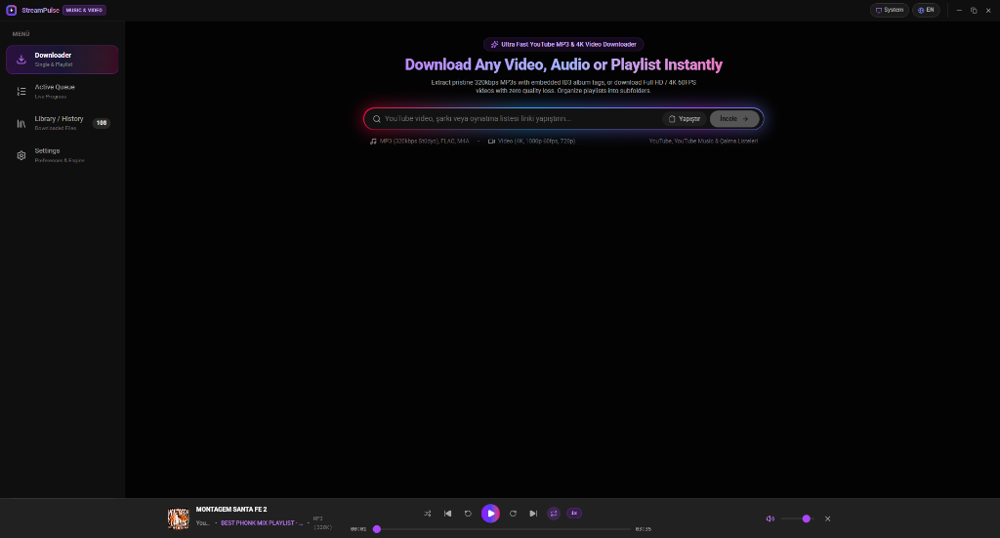
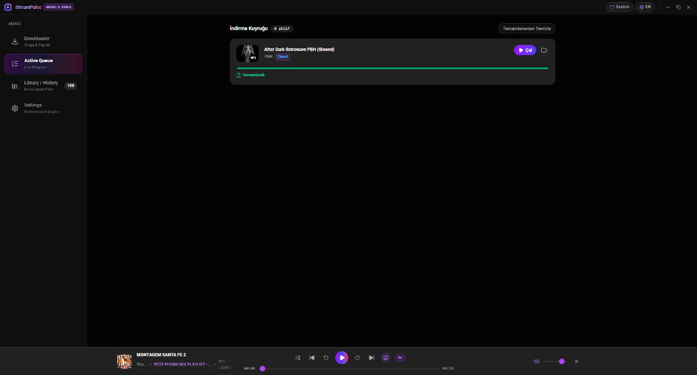
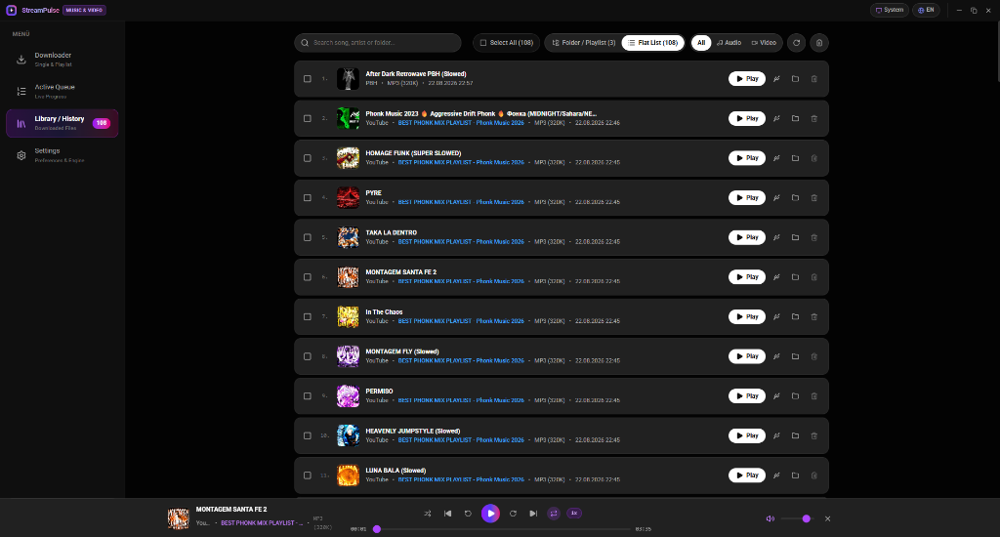
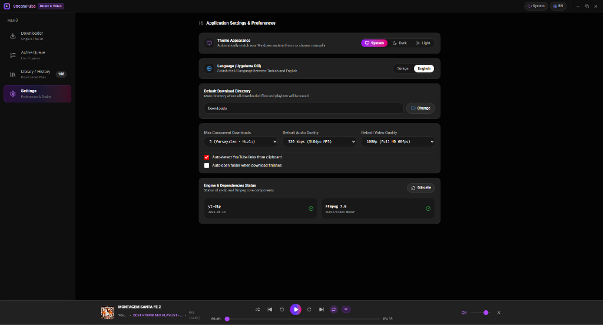

<div align="center">

# ⚡ StreamPulse Downloader Pro

**Ultra Hızlı, Modern ve Yüksek Performanslı YouTube & YouTube Music MP3, 4K Video İndirici ve AI Canlı Müzik Tanıma Ekosistemi**

[](https://opensource.org/licenses/MIT)
[](https://electronjs.org/)
[](https://reactjs.org/)
[](https://www.typescriptlang.org/)
[](https://tailwindcss.com/)
[](https://github.com/yt-dlp/yt-dlp)
[](https://ffmpeg.org/)
[](https://github.com)

<p align="center">
  <b>Geliştirici:</b> <a href="https://github.com/ryuga-w">Yüksel Bilgin</a> (AI-Driven Full Stack Developer)
</p>

</div>

---

## 🌟 Genel Bakış (Overview)

**StreamPulse Downloader Pro**, YouTube ve YouTube Music platformlarından tekli parçaları, albümleri ve 50+ parçalık dev oynatma listelerini **320kbps stüdyo ses kalitesinde** ve **4K 60FPS kayıpsız video formatında** indiren modern, yeni nesil bir masaüstü uygulaması ve Chrome eklentisidir.

Gelişmiş **StreamPulse Aurora akışkan parıltı arayüzü**, **Canlı Ses Ekolayzerli Kuantum Sıvı Müzik Tanıma Motoru**, **Gruplandırılmış Akordeon Çalma Listesi Kuyruğu**, **Dahili YouTube Music tarzı Medya Oynatıcısı**, **Tek Tıkla USB / Araç Belleğine Senkronizasyon Motoru** ve **Karanlık / Aydınlık mod** desteğiyle donatılmıştır.

---

## 📸 Ekran Görüntüleri (Screenshots)

<div align="center">
  
  <p><i>StreamPulse Aurora Akışkan Işıltılı Arama Kutusu, 320kbps MP3 / 4K Video İndirici ve Dahili Medya Oynatıcısı</i></p>

  <br/>

  <table width="100%">
    <tr>
      <td width="50%" align="center">
        <b>📦 Gruplandırılmış İndirme Kuyruğu</b><br/>
        
      </td>
      <td width="50%" align="center">
        <b>📚 Kütüphane & Geçmiş Oynatıcı</b><br/>
        
      </td>
    </tr>
    <tr>
      <td colspan="2" align="center">
        <b>⚙️ Ayarlar & Motor Durumu Tanılaması</b><br/>
        
      </td>
    </tr>
  </table>
</div>

---

## 🚀 Öne Çıkan Özellikler (Key Features)

### 🎵 1. Ultra Yüksek Kalite Ses & Video İndirme
- **Stüdyo Kalitesinde MP3:** 320 kbps CBR/V0, 48.000 Hz örnekleme oranıyla stüdyo netliğinde ses.
- **Kayıpsız Formatlar:** FLAC, WAV, M4A (AAC) formatlarında sıfır yeniden kodlama kaybı.
- **4K 60FPS Ultra HD Video:** 2160p (4K), 1440p (2K), 1080p (Full HD) ve 720p video desteği.
- **Otomatik ID3 & Kapak Resmi Gömme:** Şarkı adı, sanatçı, albüm bilgisi ve orijinal HD kapak resmi dosyanın içine otomatik işlenir.

### 🔮 2. Chrome Eklentisi & Canlı Kuantum AI Müzik Tanıma
- **Sekme Sesi Dinleme:** TikTok, Instagram, Twitter/X, YouTube veya herhangi bir web sekmesinde çalan şarkıyı anında akustik parmak iziyle tanır.
- **Canlı Ekolayzır Reaktif Aurora Sıvı Dalgası:** Şarkının bas, mid ve tiz frekanslarına göre gerçek zamanlı dalgalanan akışkan ışık animasyonu ve kuantum yıldız tozu ışıltıları.
- **Tek Tıkla Masaüstüne Aktarma:** Web sekmesindeki herhangi bir YouTube videosunu veya tanınan şarkıyı doğrudan masaüstü uygulamasının indirme kuyruğuna fırlatır.

### 📦 3. Gruplandırılmış Akordeon Çalma Listesi Kuyruğu
- 200+ parçalık dev çalma listeleri kuyruğu tek tek kartlarla boğmak yerine, tek bir şık **"ÇALMA LİSTESİ"** kartında toplanır.
- Genel liste ilerleme çubuğu, toplam hız, kalan süre ve **"Parçaları Göster / Gizle"** açılır akordeon detay listesi.
- Çalma listesi tamamlandığında tek tek 200 bildirim yerine **tek bir özet Windows bildirimi** gönderilir.

### 🚗 4. Tek Tıkla USB & Araç Müzik Belleği Senkronizasyonu
- Bilgisayara takılı USB bellekleri ve harici diskleri anında tanır (`FAT32 / exFAT / NTFS`).
- İndirilen tüm albümü veya seçili parçaları tek tıkla USB'ye aktarır.
- **Araç Teybi Uyumluluk Modu:** Eski model otomobil teypleri için özel dosya adı ve FAT32 optimizasyonu uygular.

### 🎧 5. Dahili Medya Oynatıcı & Canlı Sıradaki Parçalar Çekmecesi
- İndirdiğiniz parçaları uygulamadan çıkmadan dinleyin.
- Çalan şarkıya tıklandığında sağ alt köşeden açılan **Sıradaki Parçalar (Up Next Queue)** çekmecesi.
- Canlı ekolayzır animasyonu, 10s ileri/geri sarma, hız ayarı (`0.75x - 2x`), karışık ve tekrar modları.

### 🎨 6. Yeni Nesil Arayüz (UI & UX)
- **Modern Expressive Tasarım:** Yüksek kontrastlı, göz yormayan Açık (`Light`) ve Koyu (`OLED Dark`) temalar.
- **Çift Dil Desteği:** Türkçe & İngilizce tek tıkla dinamik geçiş.

---

## 🛠️ Teknoloji Yığını (Tech Stack)

| Katman | Teknoloji | Açıklama |
|---|---|---|
| **Masaüstü Çatısı** | [Electron 43](https://electronjs.org/) | Yerel Windows IPC, USB sürücü algılama ve dosya sistemi yönetimi |
| **Ön Yüz (Frontend)** | [React 19](https://react.dev/) + [TypeScript](https://www.typescriptlang.org/) | Hızlı, tip güvenli modern bileşen mimarisi |
| **Tarayıcı Eklentisi** | [Chrome Manifest V3](https://developer.chrome.com/docs/extensions/) | Web Audio AnalyserNode + Offscreen Document canlı FFT ses yakalama |
| **Stil & Animasyon** | [Tailwind CSS 4](https://tailwindcss.com/) + [Lucide Icons](https://lucide.dev/) | Glassmorphism, CSS neon parıltıları ve mikro etkileşimler |
| **İndirme Motoru** | [yt-dlp](https://github.com/yt-dlp/yt-dlp) | YouTube / YouTube Music medya ayrıştırma motoru |
| **Medya Çevirici** | [FFmpeg 7.0](https://ffmpeg.org/) | 320kbps MP3 dönüşümü, muxing ve ID3 kapak resmi gömücü |
| **AI Müzik Tanıma** | [StreamPulse AI Core](https://github.com/ryuga-w/StreamPulse) | Raw PCM FFT frekans tepe noktaları & akustik parmak izi eşleme |
| **Yerel Sunucu** | [Node.js Express](https://expressjs.com/) | Eklenti - Masaüstü IPC köprüsü, ses akışı ve SSE ilerleme bildirimleri |
| **Derleyici (Bundler)** | [Vite 8](https://vitejs.dev/) | Anlık HMR (Hot Module Replacement) geliştirme ortamı |

---

## 📥 Kurulum ve Geliştirme (Installation & Development)

### Gereksinimler
- **Node.js** (v18 veya üzeri)
- **Python 3** (yt-dlp için)
- **Git**

### 1. Depoyu Klonlayın
```bash
git clone https://github.com/ryuga-w/StreamPulse.git
cd StreamPulse
```

### 2. Bağımlılıkları Yükleyin
```bash
npm install
```

### 3. Geliştirme Modunda Çalıştırın (Dev Mode)
```bash
npm run dev
```

### 4. Üretim İçin Paketleyin (Production Build)
```bash
npm run build:win
```

---

## 🧩 Chrome Eklentisini Yükleme (Chrome Extension)
1. Chrome'da `chrome://extensions/` adresine gidin.
2. Sağ üstteki **Geliştirici Modu (Developer mode)** anahtarını açın.
3. **Paketlenmemiş öğe yükle (Load unpacked)** butonuna basarak projedeki `extension/` klasörünü seçin.

---

## 📦 Kurulum Dosyası Hazırlama (Build & Package)

Windows için modern NSIS kurulum sihirbazını veya Portable sürümü oluşturmak için:

```bash
# Standart Windows Kurulum Paketi (NSIS Setup .exe)
npm run dist

# Tek Tıklamalı Taşınabilir Sürüm (Portable .exe)
npm run dist:portable

# Hem Kurulum Sihirbazı Hem Portable Sürümü Derle
npm run dist:all
```

Derlenen kurulum dosyaları otomatik olarak **`release/`** klasörüne kaydedilir.

---

## 📄 Lisans (License)

Bu proje [MIT Lisansı](LICENSE) kapsamında açık kaynak olarak yayımlanmıştır.

---

<div align="center">
  <sub>Geliştirici: <b>Yüksel Bilgin</b> • Made with ❤️ for Music Lovers</sub>
</div>
